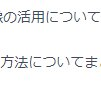

# Title

---
## Page1-1

normal text

+++

## Page1-2

Ruby code

```ruby
class Hoge
  def hoge
    puts "hoge"
  end
end
```

---

## Page 2

>引用

* 箇条書き1
* 箇条書き2

---

## Page 3



---?image=assets/bg.png

---

## Fin

おわり

